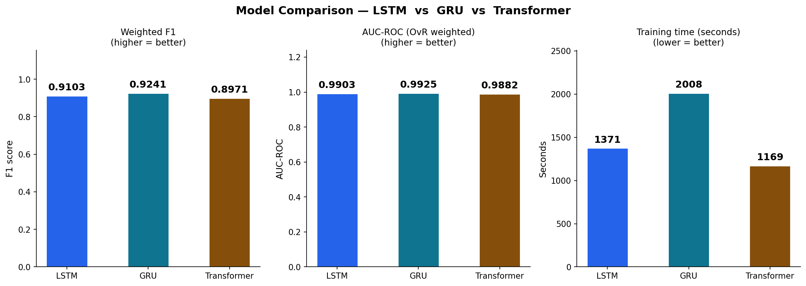
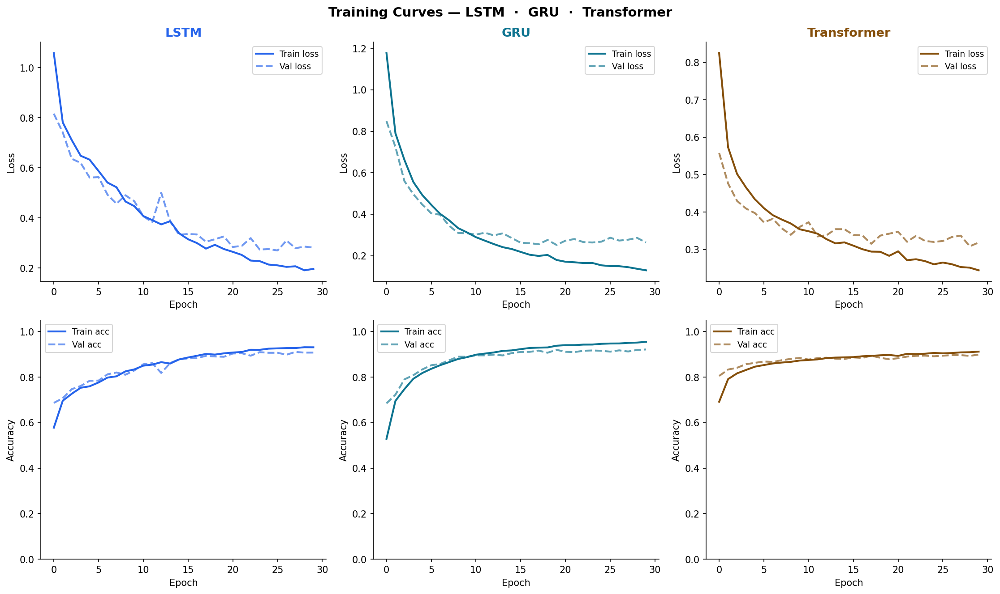
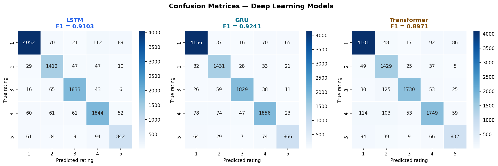
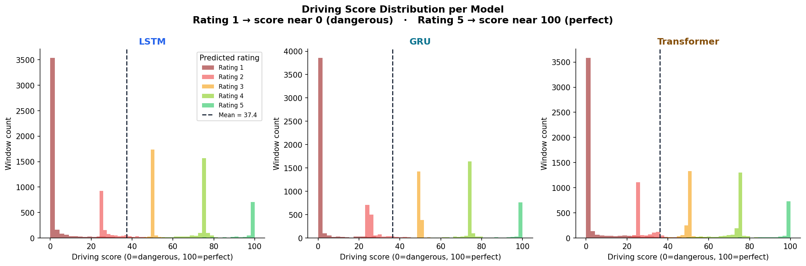
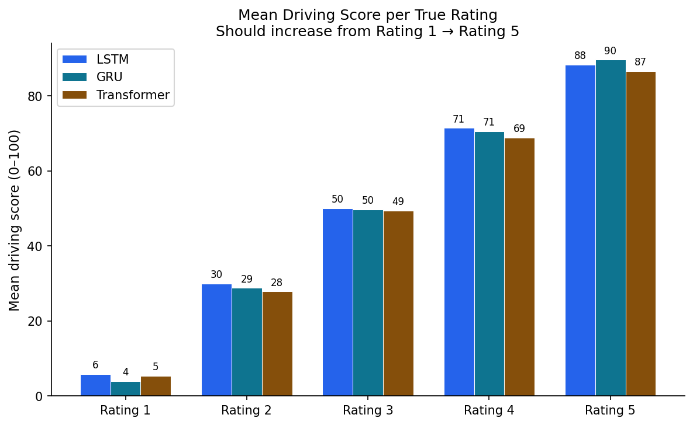

# Driving Risk Score System
### Mini Project 2 — Motion Sensor Based Driving Behaviour Analysis

A deep learning pipeline that analyses accelerometer and gyroscope readings from an Android phone to generate a **0–100 Driving Score** indicating how safely an individual drives a two-wheeler.

---

## Score Scale

| Score | Stars | Band | Meaning |
|-------|-------|------|---------|
| 80–100 | ★★★★★ | Excellent | Smooth, controlled, safe driving |
| 60–79 | ★★★★☆ | Good | Good driving with minor events |
| 40–59 | ★★★☆☆ | Moderate | Some aggressive events detected |
| 20–39 | ★★☆☆☆ | Poor | Frequent risky behaviour |
| 0–19 | ★☆☆☆☆ | Dangerous | Consistently dangerous driving |

> **100 = Perfect / Safest driver · 0 = Most dangerous driver**

---

## Dataset

Collected using an Android sensor app capturing accelerometer (X/Y/Z) and gyroscope (X/Y/Z) at ~10ms intervals.

| Property | Details |
|---|---|
| Total raw rows | 2,987,342 |
| After cleaning | 2,752,364 (92.13% retention) |
| Total windows | 54,850 |
| Train / Test | 43,880 / 10,970 (80/20 stratified) |
| Ratings | 1 star (dangerous) → 5 star (safest) |

**Dataset variations collected:**
- Multiple riders (Ayan, Rohan, Sanjay, Vikram, Yogesh, Manish, Sonu, Shabbir, and more)
- Multiple vehicles (scooter, bike)
- Different speeds (slow, medium, fast)
- Different phone placements (pocket, handlebar mount, backpack)

---

## Models

Three deep learning models trained and compared:

| Model | Architecture | Val Accuracy | F1 | AUC-ROC | Train Time |
|-------|-------------|-------------|-----|---------|-----------|
| **GRU** ⭐ | 2× GRU (128→64) | **92.16%** | **0.9241** | **0.9925** | 2008s |
| LSTM | 2× LSTM (128→64) | 90.79% | 0.9103 | 0.9903 | 1371s |
| Transformer | 2× Self-attention (64 dim, 4 heads) | 89.93% | 0.8971 | 0.9882 | 1169s |

**Best model: GRU** — highest F1 and AUC with consistent 30-epoch training.

---

## Pipeline

```
data/raw_real/
├── 1 star/   ← dangerous driving CSVs
├── 2 star/
├── 3 star/
├── 4 star/
└── 5 star/   ← safe driving CSVs
      ↓
step0_prepare.py    → restructure + clean + build sequences
step1_train.py      → train LSTM / GRU / Transformer (30 epochs each)
step2_evaluate.py   → compare models, generate charts
step3_score.py      → score any new session CSV
app.py              → Streamlit dashboard
```

---

## Results

### Model Comparison


### Training Curves


### Confusion Matrices


### Score Distribution


### Mean Score per Rating


---

## Setup and Run

### 1. Clone the repo
```bash
git clone https://github.com/HemantChoudhary6ii6/24UADS1021-HEMANTKUMAR-NNLAB-2026.git
cd lab-work/DrivingScore
```

### 2. Create virtual environment
```bash
python -m venv venv
venv\Scripts\activate        # Windows
source venv/bin/activate     # Mac / Linux
```

### 3. Install dependencies
```bash
pip install -r requirements.txt
```

### 4. Add your data
Place your star-rated folders in `data/raw_real/`:
```
data/raw_real/
├── 1 star/
├── 2 star/
├── 3 star/
├── 4 star/
└── 5 star/
```

### 5. Run the full pipeline
```bash
python run_pipeline.py
```

### 6. Launch the dashboard
```bash
streamlit run app.py
```

---

## Score a New Session

```bash
python step3_score.py path/to/session.csv
python step3_score.py path/to/session.csv --model lstm
python step3_score.py path/to/session.csv --model transformer
```

---

## Tech Stack

| Layer | Tools |
|---|---|
| Data processing | Python, pandas, numpy |
| Deep learning | TensorFlow 2.16, Keras |
| Models | LSTM, GRU, Transformer |
| Evaluation | scikit-learn, matplotlib, seaborn |
| Dashboard | Streamlit |

---

## Key Findings

- **GRU outperforms LSTM and Transformer** on this dataset — 92.16% validation accuracy
- **AUC-ROC above 0.99** for all three models — excellent class separation
- **Transformer trains fastest** (1169s) but slightly lower accuracy than GRU
- **30-epoch training** with no early stopping ensures fair comparison
- **92.13% data retention** after cleaning — robust real-world sensor pipeline